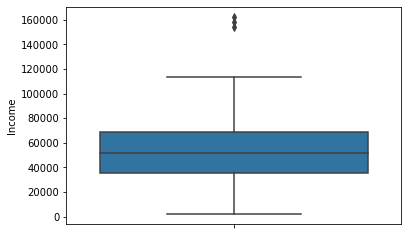

# Customer consumption prediction based on past dataset

## Author: Seung Hun Han

Link: https://dacon.io/competitions/official/235893/data


```python
import pandas as pd
from pandas_profiling import pandas_profiling
import numpy as np
import torch
```


```python
data_set=pd.read_csv('G:/내 드라이브/github/Revenue_prediction/Data_set/train.csv')
```

## EDA

Variables
id : Sample ID
Year_Birth : costumer Date of Birth
Education : costumer Education 
Marital_status : Marital Status
Income : costumer yearly income
Kidhome : Number of kids at household 
Teenhome : Number of teenagers at household 
Dt_Customer : Date of register
Recency : Days past since the last purchase 
NumDealsPurchases : Number of discounted deals costumer made
NumWebPurchases : Number of purchase through website
NumCatalogPurchases : Number of purchases through catalog
NumStorePuchases : Number of purchases through offline shop
NumWebVisitsMonth : Number of visits to the website in previous month
AcceptedCmp1: Customer accepted the first campaign: 1 else 0
AcceptedCmp2: Customer accepted the second campaign: 1 else 0
AcceptedCmp3: Customer accepted the third campaign: 1 else 0
AcceptedCmp4: Customer accepted fourth campaign: 1 else 0
AcceptedCmp5: Customer accepted fifth campaign: 1 else 0
Complain : Made at least one complain in the past two years: 1 else 0 
Response : Customer accepted the last campaign: 1 else 0
target : Total consumption made


```python
report=data_set.profile_report()
report.to_file('report.html') 
## Create pandas profile report to get general understanding of the data set
```


    Summarize dataset:   0%|          | 0/5 [00:00<?, ?it/s]


    Generate report structure:   0%|          | 0/1 [00:00<?, ?it/s]


    Render HTML:   0%|          | 0/1 [00:00<?, ?it/s]


    Export report to file:   0%|          | 0/1 [00:00<?, ?it/s]


```python
data_set.isna().sum()
# There seems to be no missing values for all variables.
```


    id                     0
    Year_Birth             0
    Education              0
    Marital_Status         0
    Income                 0
    Kidhome                0
    Teenhome               0
    Dt_Customer            0
    Recency                0
    NumDealsPurchases      0
    NumWebPurchases        0
    NumCatalogPurchases    0
    NumStorePurchases      0
    NumWebVisitsMonth      0
    AcceptedCmp3           0
    AcceptedCmp4           0
    AcceptedCmp5           0
    AcceptedCmp1           0
    AcceptedCmp2           0
    Complain               0
    Response               0
    target                 0
    dtype: int64


Records of most of the variables seem to be in order.
However, there are 4 observtions with undefined marital status. 


```python
data_set.groupby('Marital_Status').size()
```


    Marital_Status
    Absurd        1
    Alone         2
    Divorced    120
    Married     415
    Single      234
    Together    296
    Widow        39
    YOLO          1
    dtype: int64


## Regrouping Marital Status variable

1. Absurd 2. Alone 3. YOLO seem to be a ungrouped observations.
Relocate those who responded marital status as "Alone and YOLO" to "Single" group.

Remove the responder who answered "Absurd" from the data set as the word itself is very vague.


```python
data_set[data_set['Marital_Status']=='Absurd']
```


<div>
<style scoped>
    .dataframe tbody tr th:only-of-type {
        vertical-align: middle;
    }

    .dataframe tbody tr th {
        vertical-align: top;
    }

    .dataframe thead th {
        text-align: right;
    }
</style>
<table border="1" class="dataframe">
  <thead>
    <tr style="text-align: right;">
      <th></th>
      <th>id</th>
      <th>Year_Birth</th>
      <th>Education</th>
      <th>Marital_Status</th>
      <th>Income</th>
      <th>Kidhome</th>
      <th>Teenhome</th>
      <th>Dt_Customer</th>
      <th>Recency</th>
      <th>NumDealsPurchases</th>
      <th>...</th>
      <th>NumStorePurchases</th>
      <th>NumWebVisitsMonth</th>
      <th>AcceptedCmp3</th>
      <th>AcceptedCmp4</th>
      <th>AcceptedCmp5</th>
      <th>AcceptedCmp1</th>
      <th>AcceptedCmp2</th>
      <th>Complain</th>
      <th>Response</th>
      <th>target</th>
    </tr>
  </thead>
  <tbody>
    <tr>
      <th>677</th>
      <td>677</td>
      <td>1993</td>
      <td>Graduation</td>
      <td>Absurd</td>
      <td>79244.0</td>
      <td>0</td>
      <td>0</td>
      <td>19-12-2012</td>
      <td>58</td>
      <td>1</td>
      <td>...</td>
      <td>7</td>
      <td>1</td>
      <td>0</td>
      <td>0</td>
      <td>1</td>
      <td>1</td>
      <td>0</td>
      <td>0</td>
      <td>1</td>
      <td>1216</td>
    </tr>
  </tbody>
</table>
<p>1 rows × 22 columns</p>
</div>


```python
data_set.drop(index=677,inplace=True)
```


```python
data_set.loc[data_set['Marital_Status']== 'Alone','Marital_Status']='Single' #Relocate Alone and YOLO
data_set.loc[data_set['Marital_Status']== 'YOLO','Marital_Status']='Single'
```

All the anomalies have been dealt.  


```python
data_set.groupby('Marital_Status').size() ## Successfully relocated
```


    Marital_Status
    Divorced    120
    Married     415
    Single      237
    Together    296
    Widow        39
    dtype: int64


Marital status could be narrowed down to smaller groups:
1. In a relationship (Married, Together)
2. Not in a relationship (Divorced, Single, Widow)


```python
data_set['Relationship']=0
for i in range(len(data_set)):
    try:
        if data_set['Marital_Status'][i] in ['Married','Together']: #Regroup marital status
            data_set['Relationship'][i]=1
    except:
        continue
```

## Regrouping Education variable

Education variable also can be regrouped into three groups:
1. Bachelor's Degree
2. Master's Degree
3. Doctorate Degree


```python
data_set.groupby('Education').size()
```


    Education
    2n Cycle       89
    Basic          22
    Graduation    569
    Master        173
    PhD           254
    dtype: int64


```python
sns.countplot('Education',data=data_set)
```


    <AxesSubplot:xlabel='Education', ylabel='count'>


    

    


Interestingly, number of customers with PhD degree is nearly half of those who have high school diploma.  


```python
sns.barplot(data_set['Education'],data_set['target'])
```


    <AxesSubplot:xlabel='Education', ylabel='target'>


    

    


Though further statistical analysis is paramount, graduate school graduates had made more consumptions than the high school graduates. It is not certain whether such trend could be taken into account, yet it is quite unexpected and astonishing.


```python
data_set['Edu']=0
for i in range(len(data_set)):
    try:
        if data_set['Education'][i] in ['Master','2n Cycle']:
            data_set['Edu'][i]=1
        elif data_set['Education'][i] == 'PhD':
            data_set['Edu'][i]=2
    except:
        continue
```


```python
data_set['Edu'].value_counts()
```


    0    592
    1    262
    2    253
    Name: Edu, dtype: int64


Two responders replied that they were born in the 19th century, which seems quite odd. Those observtions could be regarded as outliers, so remove them from dataset.


```python
data_set.groupby('Year_Birth').size().head()
```


    Year_Birth
    1893    1
    1900    1
    1940    1
    1941    1
    1943    5
    dtype: int64


```python
data_set.drop(index=data_set[data_set['Year_Birth']<=1900]['id'],inplace=True)
```


```python
data_set.groupby('Year_Birth').size().head()
```


    Year_Birth
    1940    1
    1941    1
    1943    5
    1944    4
    1945    5
    dtype: int64


```python
import seaborn as sns
import matplotlib.pyplot as plt
```

## Income variable: Dealing With Outliers

Without a doubt, income data would be variable. Therefore, evaluation of data regards to existence of outliers is necessary.


```python
sns.histplot(data_set['Income'])
```


    <AxesSubplot:xlabel='Income', ylabel='Count'>


    

    


Lower bound of the distribution does not seem to contain much outliers.
Conversely, the upper bound has a few noticeable outliers.


```python
import scipy.stats as stats
```


```python
sns.boxplot(y=data_set['Income'])
#Boxplot suggests three distinct outliers near the upper bound.
```


    <AxesSubplot:ylabel='Income'>


    

    


```python
sns.distplot(data_set['Income'],bins=50)
# Despite existence of a few outliers, data seems to follow standard normal distribution. 
# Removal of outliers would improve fitness to normal distribution.
```


    <AxesSubplot:xlabel='Income', ylabel='Density'>


    

    


```python
qq=stats.probplot(data_set['Income'],plot=plt)
## QQ plot also indicates a few outliers.
```


    

    


```python
data_set.sort_values('Income').head(20)
# Income smaller than 10000 could be considered outliers. 
```


<div>
<style scoped>
    .dataframe tbody tr th:only-of-type {
        vertical-align: middle;
    }

    .dataframe tbody tr th {
        vertical-align: top;
    }

    .dataframe thead th {
        text-align: right;
    }
</style>
<table border="1" class="dataframe">
  <thead>
    <tr style="text-align: right;">
      <th></th>
      <th>id</th>
      <th>Year_Birth</th>
      <th>Education</th>
      <th>Marital_Status</th>
      <th>Income</th>
      <th>Kidhome</th>
      <th>Teenhome</th>
      <th>Dt_Customer</th>
      <th>Recency</th>
      <th>NumDealsPurchases</th>
      <th>...</th>
      <th>AcceptedCmp3</th>
      <th>AcceptedCmp4</th>
      <th>AcceptedCmp5</th>
      <th>AcceptedCmp1</th>
      <th>AcceptedCmp2</th>
      <th>Complain</th>
      <th>Response</th>
      <th>target</th>
      <th>Relationship</th>
      <th>Edu</th>
    </tr>
  </thead>
  <tbody>
    <tr>
      <th>182</th>
      <td>182</td>
      <td>1971</td>
      <td>Graduation</td>
      <td>Divorced</td>
      <td>1730.0</td>
      <td>0</td>
      <td>0</td>
      <td>18-05-2014</td>
      <td>65</td>
      <td>15</td>
      <td>...</td>
      <td>0</td>
      <td>0</td>
      <td>0</td>
      <td>0</td>
      <td>0</td>
      <td>0</td>
      <td>0</td>
      <td>8</td>
      <td>0</td>
      <td>0</td>
    </tr>
    <tr>
      <th>91</th>
      <td>91</td>
      <td>1963</td>
      <td>PhD</td>
      <td>Married</td>
      <td>4023.0</td>
      <td>1</td>
      <td>1</td>
      <td>23-06-2014</td>
      <td>29</td>
      <td>15</td>
      <td>...</td>
      <td>0</td>
      <td>0</td>
      <td>0</td>
      <td>0</td>
      <td>0</td>
      <td>0</td>
      <td>0</td>
      <td>9</td>
      <td>1</td>
      <td>2</td>
    </tr>
    <tr>
      <th>1097</th>
      <td>1097</td>
      <td>1965</td>
      <td>Graduation</td>
      <td>Divorced</td>
      <td>4861.0</td>
      <td>0</td>
      <td>0</td>
      <td>22-06-2014</td>
      <td>20</td>
      <td>0</td>
      <td>...</td>
      <td>0</td>
      <td>0</td>
      <td>0</td>
      <td>0</td>
      <td>0</td>
      <td>0</td>
      <td>0</td>
      <td>6</td>
      <td>0</td>
      <td>0</td>
    </tr>
    <tr>
      <th>194</th>
      <td>194</td>
      <td>1976</td>
      <td>Graduation</td>
      <td>Married</td>
      <td>5305.0</td>
      <td>0</td>
      <td>1</td>
      <td>30-07-2013</td>
      <td>12</td>
      <td>0</td>
      <td>...</td>
      <td>0</td>
      <td>0</td>
      <td>0</td>
      <td>0</td>
      <td>0</td>
      <td>0</td>
      <td>0</td>
      <td>32</td>
      <td>1</td>
      <td>0</td>
    </tr>
    <tr>
      <th>297</th>
      <td>297</td>
      <td>1957</td>
      <td>PhD</td>
      <td>Together</td>
      <td>6835.0</td>
      <td>0</td>
      <td>1</td>
      <td>08-12-2012</td>
      <td>76</td>
      <td>0</td>
      <td>...</td>
      <td>0</td>
      <td>0</td>
      <td>0</td>
      <td>0</td>
      <td>0</td>
      <td>0</td>
      <td>0</td>
      <td>137</td>
      <td>1</td>
      <td>2</td>
    </tr>
    <tr>
      <th>617</th>
      <td>617</td>
      <td>1966</td>
      <td>PhD</td>
      <td>Single</td>
      <td>7144.0</td>
      <td>0</td>
      <td>2</td>
      <td>07-12-2013</td>
      <td>92</td>
      <td>0</td>
      <td>...</td>
      <td>0</td>
      <td>0</td>
      <td>0</td>
      <td>0</td>
      <td>0</td>
      <td>0</td>
      <td>0</td>
      <td>416</td>
      <td>0</td>
      <td>2</td>
    </tr>
    <tr>
      <th>1073</th>
      <td>1073</td>
      <td>1987</td>
      <td>Graduation</td>
      <td>Married</td>
      <td>7500.0</td>
      <td>0</td>
      <td>0</td>
      <td>09-01-2013</td>
      <td>94</td>
      <td>1</td>
      <td>...</td>
      <td>0</td>
      <td>0</td>
      <td>0</td>
      <td>0</td>
      <td>0</td>
      <td>0</td>
      <td>0</td>
      <td>15</td>
      <td>1</td>
      <td>0</td>
    </tr>
    <tr>
      <th>167</th>
      <td>167</td>
      <td>1976</td>
      <td>Graduation</td>
      <td>Married</td>
      <td>7500.0</td>
      <td>1</td>
      <td>0</td>
      <td>01-08-2012</td>
      <td>19</td>
      <td>5</td>
      <td>...</td>
      <td>1</td>
      <td>0</td>
      <td>0</td>
      <td>0</td>
      <td>0</td>
      <td>0</td>
      <td>1</td>
      <td>71</td>
      <td>1</td>
      <td>0</td>
    </tr>
    <tr>
      <th>844</th>
      <td>844</td>
      <td>1973</td>
      <td>Graduation</td>
      <td>Single</td>
      <td>7500.0</td>
      <td>1</td>
      <td>0</td>
      <td>26-12-2013</td>
      <td>54</td>
      <td>4</td>
      <td>...</td>
      <td>0</td>
      <td>0</td>
      <td>0</td>
      <td>0</td>
      <td>0</td>
      <td>0</td>
      <td>0</td>
      <td>57</td>
      <td>0</td>
      <td>0</td>
    </tr>
    <tr>
      <th>329</th>
      <td>329</td>
      <td>1976</td>
      <td>Basic</td>
      <td>Married</td>
      <td>7500.0</td>
      <td>0</td>
      <td>0</td>
      <td>13-11-2012</td>
      <td>59</td>
      <td>1</td>
      <td>...</td>
      <td>0</td>
      <td>0</td>
      <td>0</td>
      <td>0</td>
      <td>0</td>
      <td>0</td>
      <td>0</td>
      <td>61</td>
      <td>1</td>
      <td>0</td>
    </tr>
    <tr>
      <th>141</th>
      <td>141</td>
      <td>1979</td>
      <td>Graduation</td>
      <td>Married</td>
      <td>7500.0</td>
      <td>0</td>
      <td>1</td>
      <td>29-08-2012</td>
      <td>61</td>
      <td>1</td>
      <td>...</td>
      <td>0</td>
      <td>0</td>
      <td>0</td>
      <td>0</td>
      <td>0</td>
      <td>0</td>
      <td>0</td>
      <td>18</td>
      <td>1</td>
      <td>0</td>
    </tr>
    <tr>
      <th>945</th>
      <td>945</td>
      <td>1979</td>
      <td>2n Cycle</td>
      <td>Together</td>
      <td>7500.0</td>
      <td>1</td>
      <td>0</td>
      <td>07-05-2013</td>
      <td>7</td>
      <td>4</td>
      <td>...</td>
      <td>0</td>
      <td>0</td>
      <td>0</td>
      <td>0</td>
      <td>0</td>
      <td>0</td>
      <td>0</td>
      <td>53</td>
      <td>1</td>
      <td>1</td>
    </tr>
    <tr>
      <th>48</th>
      <td>48</td>
      <td>1986</td>
      <td>2n Cycle</td>
      <td>Married</td>
      <td>7500.0</td>
      <td>1</td>
      <td>0</td>
      <td>07-02-2013</td>
      <td>96</td>
      <td>2</td>
      <td>...</td>
      <td>0</td>
      <td>0</td>
      <td>0</td>
      <td>0</td>
      <td>0</td>
      <td>0</td>
      <td>0</td>
      <td>36</td>
      <td>1</td>
      <td>1</td>
    </tr>
    <tr>
      <th>953</th>
      <td>953</td>
      <td>1978</td>
      <td>Graduation</td>
      <td>Single</td>
      <td>7500.0</td>
      <td>1</td>
      <td>1</td>
      <td>27-12-2012</td>
      <td>5</td>
      <td>4</td>
      <td>...</td>
      <td>0</td>
      <td>0</td>
      <td>0</td>
      <td>0</td>
      <td>0</td>
      <td>0</td>
      <td>0</td>
      <td>57</td>
      <td>0</td>
      <td>0</td>
    </tr>
    <tr>
      <th>751</th>
      <td>751</td>
      <td>1996</td>
      <td>2n Cycle</td>
      <td>Married</td>
      <td>7500.0</td>
      <td>0</td>
      <td>0</td>
      <td>09-11-2012</td>
      <td>24</td>
      <td>3</td>
      <td>...</td>
      <td>0</td>
      <td>0</td>
      <td>0</td>
      <td>0</td>
      <td>0</td>
      <td>0</td>
      <td>1</td>
      <td>122</td>
      <td>1</td>
      <td>1</td>
    </tr>
    <tr>
      <th>950</th>
      <td>950</td>
      <td>1986</td>
      <td>Basic</td>
      <td>Single</td>
      <td>8940.0</td>
      <td>1</td>
      <td>0</td>
      <td>22-08-2012</td>
      <td>25</td>
      <td>3</td>
      <td>...</td>
      <td>0</td>
      <td>0</td>
      <td>0</td>
      <td>0</td>
      <td>0</td>
      <td>0</td>
      <td>0</td>
      <td>101</td>
      <td>0</td>
      <td>0</td>
    </tr>
    <tr>
      <th>173</th>
      <td>173</td>
      <td>1973</td>
      <td>Basic</td>
      <td>Together</td>
      <td>9722.0</td>
      <td>1</td>
      <td>0</td>
      <td>02-10-2012</td>
      <td>7</td>
      <td>4</td>
      <td>...</td>
      <td>0</td>
      <td>0</td>
      <td>0</td>
      <td>0</td>
      <td>0</td>
      <td>0</td>
      <td>1</td>
      <td>103</td>
      <td>1</td>
      <td>0</td>
    </tr>
    <tr>
      <th>990</th>
      <td>990</td>
      <td>1971</td>
      <td>Graduation</td>
      <td>Single</td>
      <td>10245.0</td>
      <td>1</td>
      <td>0</td>
      <td>15-05-2013</td>
      <td>32</td>
      <td>3</td>
      <td>...</td>
      <td>0</td>
      <td>0</td>
      <td>0</td>
      <td>0</td>
      <td>0</td>
      <td>0</td>
      <td>0</td>
      <td>41</td>
      <td>0</td>
      <td>0</td>
    </tr>
    <tr>
      <th>134</th>
      <td>134</td>
      <td>1989</td>
      <td>2n Cycle</td>
      <td>Together</td>
      <td>10404.0</td>
      <td>1</td>
      <td>0</td>
      <td>04-05-2014</td>
      <td>52</td>
      <td>2</td>
      <td>...</td>
      <td>0</td>
      <td>0</td>
      <td>0</td>
      <td>0</td>
      <td>0</td>
      <td>0</td>
      <td>0</td>
      <td>43</td>
      <td>1</td>
      <td>1</td>
    </tr>
    <tr>
      <th>499</th>
      <td>499</td>
      <td>1984</td>
      <td>Graduation</td>
      <td>Single</td>
      <td>11012.0</td>
      <td>1</td>
      <td>0</td>
      <td>16-03-2013</td>
      <td>82</td>
      <td>3</td>
      <td>...</td>
      <td>1</td>
      <td>0</td>
      <td>0</td>
      <td>0</td>
      <td>0</td>
      <td>0</td>
      <td>0</td>
      <td>84</td>
      <td>0</td>
      <td>0</td>
    </tr>
  </tbody>
</table>
<p>20 rows × 24 columns</p>
</div>


```python
data_set.sort_values('Income').tail(5)
```


<div>
<style scoped>
    .dataframe tbody tr th:only-of-type {
        vertical-align: middle;
    }

    .dataframe tbody tr th {
        vertical-align: top;
    }

    .dataframe thead th {
        text-align: right;
    }
</style>
<table border="1" class="dataframe">
  <thead>
    <tr style="text-align: right;">
      <th></th>
      <th>id</th>
      <th>Year_Birth</th>
      <th>Education</th>
      <th>Marital_Status</th>
      <th>Income</th>
      <th>Kidhome</th>
      <th>Teenhome</th>
      <th>Dt_Customer</th>
      <th>Recency</th>
      <th>NumDealsPurchases</th>
      <th>...</th>
      <th>AcceptedCmp3</th>
      <th>AcceptedCmp4</th>
      <th>AcceptedCmp5</th>
      <th>AcceptedCmp1</th>
      <th>AcceptedCmp2</th>
      <th>Complain</th>
      <th>Response</th>
      <th>target</th>
      <th>Relationship</th>
      <th>Edu</th>
    </tr>
  </thead>
  <tbody>
    <tr>
      <th>214</th>
      <td>214</td>
      <td>1983</td>
      <td>Graduation</td>
      <td>Single</td>
      <td>101970.0</td>
      <td>0</td>
      <td>0</td>
      <td>12-03-2013</td>
      <td>69</td>
      <td>0</td>
      <td>...</td>
      <td>0</td>
      <td>1</td>
      <td>1</td>
      <td>1</td>
      <td>0</td>
      <td>0</td>
      <td>1</td>
      <td>1135</td>
      <td>0</td>
      <td>0</td>
    </tr>
    <tr>
      <th>892</th>
      <td>892</td>
      <td>1945</td>
      <td>PhD</td>
      <td>Single</td>
      <td>113734.0</td>
      <td>0</td>
      <td>0</td>
      <td>28-05-2014</td>
      <td>9</td>
      <td>0</td>
      <td>...</td>
      <td>0</td>
      <td>0</td>
      <td>0</td>
      <td>0</td>
      <td>0</td>
      <td>0</td>
      <td>0</td>
      <td>277</td>
      <td>0</td>
      <td>2</td>
    </tr>
    <tr>
      <th>686</th>
      <td>686</td>
      <td>1975</td>
      <td>Graduation</td>
      <td>Divorced</td>
      <td>153924.0</td>
      <td>0</td>
      <td>0</td>
      <td>07-02-2014</td>
      <td>81</td>
      <td>0</td>
      <td>...</td>
      <td>0</td>
      <td>0</td>
      <td>0</td>
      <td>0</td>
      <td>0</td>
      <td>0</td>
      <td>0</td>
      <td>6</td>
      <td>0</td>
      <td>0</td>
    </tr>
    <tr>
      <th>730</th>
      <td>730</td>
      <td>1971</td>
      <td>Master</td>
      <td>Together</td>
      <td>157733.0</td>
      <td>1</td>
      <td>0</td>
      <td>04-06-2013</td>
      <td>37</td>
      <td>0</td>
      <td>...</td>
      <td>0</td>
      <td>0</td>
      <td>0</td>
      <td>0</td>
      <td>0</td>
      <td>0</td>
      <td>0</td>
      <td>59</td>
      <td>1</td>
      <td>1</td>
    </tr>
    <tr>
      <th>246</th>
      <td>246</td>
      <td>1976</td>
      <td>PhD</td>
      <td>Together</td>
      <td>162397.0</td>
      <td>1</td>
      <td>1</td>
      <td>03-06-2013</td>
      <td>31</td>
      <td>0</td>
      <td>...</td>
      <td>0</td>
      <td>0</td>
      <td>0</td>
      <td>0</td>
      <td>0</td>
      <td>0</td>
      <td>0</td>
      <td>107</td>
      <td>1</td>
      <td>2</td>
    </tr>
  </tbody>
</table>
<p>5 rows × 24 columns</p>
</div>


## Solution to Outliers

For upper bounded income data, observations recorded at the top 3 are definitely outliers.

To sum up, removal of income data smaller than 7500 and top 3 income observations would improve the fitness of final model.


```python
data_set.drop(index=data_set[data_set['Income']<7500]['id'],inplace=True)
data_set.drop(index=data_set.sort_values('Income',ascending=False).head(3)['id'],inplace=True)
```


```python
fig = plt.figure(figsize = (16,6))
ax1 = fig.add_subplot(1,2,1)
ax2 = fig.add_subplot(1,2,2)

stats.probplot(data_set['Income'],plot=ax1)
sns.distplot(data_set['Income'],bins=50,ax=ax2)
```


    <AxesSubplot:xlabel='Income', ylabel='Density'>


    

    


```python
data_set.sort_values('Income').tail(5)
```


<div>
<style scoped>
    .dataframe tbody tr th:only-of-type {
        vertical-align: middle;
    }

    .dataframe tbody tr th {
        vertical-align: top;
    }

    .dataframe thead th {
        text-align: right;
    }
</style>
<table border="1" class="dataframe">
  <thead>
    <tr style="text-align: right;">
      <th></th>
      <th>id</th>
      <th>Year_Birth</th>
      <th>Education</th>
      <th>Marital_Status</th>
      <th>Income</th>
      <th>Kidhome</th>
      <th>Teenhome</th>
      <th>Dt_Customer</th>
      <th>Recency</th>
      <th>NumDealsPurchases</th>
      <th>...</th>
      <th>AcceptedCmp3</th>
      <th>AcceptedCmp4</th>
      <th>AcceptedCmp5</th>
      <th>AcceptedCmp1</th>
      <th>AcceptedCmp2</th>
      <th>Complain</th>
      <th>Response</th>
      <th>target</th>
      <th>Relationship</th>
      <th>Edu</th>
    </tr>
  </thead>
  <tbody>
    <tr>
      <th>286</th>
      <td>286</td>
      <td>1977</td>
      <td>Graduation</td>
      <td>Together</td>
      <td>96876.0</td>
      <td>0</td>
      <td>0</td>
      <td>06-08-2013</td>
      <td>79</td>
      <td>1</td>
      <td>...</td>
      <td>0</td>
      <td>1</td>
      <td>1</td>
      <td>1</td>
      <td>0</td>
      <td>0</td>
      <td>1</td>
      <td>1941</td>
      <td>1</td>
      <td>0</td>
    </tr>
    <tr>
      <th>679</th>
      <td>679</td>
      <td>1960</td>
      <td>Master</td>
      <td>Single</td>
      <td>98777.0</td>
      <td>0</td>
      <td>0</td>
      <td>17-02-2014</td>
      <td>23</td>
      <td>0</td>
      <td>...</td>
      <td>0</td>
      <td>1</td>
      <td>0</td>
      <td>0</td>
      <td>0</td>
      <td>0</td>
      <td>0</td>
      <td>2008</td>
      <td>0</td>
      <td>1</td>
    </tr>
    <tr>
      <th>591</th>
      <td>591</td>
      <td>1960</td>
      <td>Master</td>
      <td>Single</td>
      <td>98777.0</td>
      <td>0</td>
      <td>0</td>
      <td>17-02-2014</td>
      <td>23</td>
      <td>0</td>
      <td>...</td>
      <td>0</td>
      <td>1</td>
      <td>0</td>
      <td>0</td>
      <td>0</td>
      <td>0</td>
      <td>0</td>
      <td>2008</td>
      <td>0</td>
      <td>1</td>
    </tr>
    <tr>
      <th>214</th>
      <td>214</td>
      <td>1983</td>
      <td>Graduation</td>
      <td>Single</td>
      <td>101970.0</td>
      <td>0</td>
      <td>0</td>
      <td>12-03-2013</td>
      <td>69</td>
      <td>0</td>
      <td>...</td>
      <td>0</td>
      <td>1</td>
      <td>1</td>
      <td>1</td>
      <td>0</td>
      <td>0</td>
      <td>1</td>
      <td>1135</td>
      <td>0</td>
      <td>0</td>
    </tr>
    <tr>
      <th>892</th>
      <td>892</td>
      <td>1945</td>
      <td>PhD</td>
      <td>Single</td>
      <td>113734.0</td>
      <td>0</td>
      <td>0</td>
      <td>28-05-2014</td>
      <td>9</td>
      <td>0</td>
      <td>...</td>
      <td>0</td>
      <td>0</td>
      <td>0</td>
      <td>0</td>
      <td>0</td>
      <td>0</td>
      <td>0</td>
      <td>277</td>
      <td>0</td>
      <td>2</td>
    </tr>
  </tbody>
</table>
<p>5 rows × 24 columns</p>
</div>


Income data has quite extensive range and still does not quite follow ideal bell-shaped curve. Hence, converting it to categorical format would be more sensible.

Precisely, make ten levels of income group by using equal distancing of 10000 

1. <10000 (Encoded to 0)
2. >=10000 & <20000 (Encoded to 1)
...
9. >=90000 & <100000
10. >=100000 (Encoded to 10)


```python
data_set['Income_category']= data_set['Income'] // 10000
data_set.loc[data_set['Income']>100000,'Income_category']=10
```


```python
data_set.sort_values('Income').tail(5)
```


<div>
<style scoped>
    .dataframe tbody tr th:only-of-type {
        vertical-align: middle;
    }

    .dataframe tbody tr th {
        vertical-align: top;
    }

    .dataframe thead th {
        text-align: right;
    }
</style>
<table border="1" class="dataframe">
  <thead>
    <tr style="text-align: right;">
      <th></th>
      <th>id</th>
      <th>Year_Birth</th>
      <th>Education</th>
      <th>Marital_Status</th>
      <th>Income</th>
      <th>Kidhome</th>
      <th>Teenhome</th>
      <th>Dt_Customer</th>
      <th>Recency</th>
      <th>NumDealsPurchases</th>
      <th>...</th>
      <th>AcceptedCmp4</th>
      <th>AcceptedCmp5</th>
      <th>AcceptedCmp1</th>
      <th>AcceptedCmp2</th>
      <th>Complain</th>
      <th>Response</th>
      <th>target</th>
      <th>Relationship</th>
      <th>Edu</th>
      <th>Income_category</th>
    </tr>
  </thead>
  <tbody>
    <tr>
      <th>286</th>
      <td>286</td>
      <td>1977</td>
      <td>Graduation</td>
      <td>Together</td>
      <td>96876.0</td>
      <td>0</td>
      <td>0</td>
      <td>06-08-2013</td>
      <td>79</td>
      <td>1</td>
      <td>...</td>
      <td>1</td>
      <td>1</td>
      <td>1</td>
      <td>0</td>
      <td>0</td>
      <td>1</td>
      <td>1941</td>
      <td>1</td>
      <td>0</td>
      <td>9.0</td>
    </tr>
    <tr>
      <th>679</th>
      <td>679</td>
      <td>1960</td>
      <td>Master</td>
      <td>Single</td>
      <td>98777.0</td>
      <td>0</td>
      <td>0</td>
      <td>17-02-2014</td>
      <td>23</td>
      <td>0</td>
      <td>...</td>
      <td>1</td>
      <td>0</td>
      <td>0</td>
      <td>0</td>
      <td>0</td>
      <td>0</td>
      <td>2008</td>
      <td>0</td>
      <td>1</td>
      <td>9.0</td>
    </tr>
    <tr>
      <th>591</th>
      <td>591</td>
      <td>1960</td>
      <td>Master</td>
      <td>Single</td>
      <td>98777.0</td>
      <td>0</td>
      <td>0</td>
      <td>17-02-2014</td>
      <td>23</td>
      <td>0</td>
      <td>...</td>
      <td>1</td>
      <td>0</td>
      <td>0</td>
      <td>0</td>
      <td>0</td>
      <td>0</td>
      <td>2008</td>
      <td>0</td>
      <td>1</td>
      <td>9.0</td>
    </tr>
    <tr>
      <th>214</th>
      <td>214</td>
      <td>1983</td>
      <td>Graduation</td>
      <td>Single</td>
      <td>101970.0</td>
      <td>0</td>
      <td>0</td>
      <td>12-03-2013</td>
      <td>69</td>
      <td>0</td>
      <td>...</td>
      <td>1</td>
      <td>1</td>
      <td>1</td>
      <td>0</td>
      <td>0</td>
      <td>1</td>
      <td>1135</td>
      <td>0</td>
      <td>0</td>
      <td>10.0</td>
    </tr>
    <tr>
      <th>892</th>
      <td>892</td>
      <td>1945</td>
      <td>PhD</td>
      <td>Single</td>
      <td>113734.0</td>
      <td>0</td>
      <td>0</td>
      <td>28-05-2014</td>
      <td>9</td>
      <td>0</td>
      <td>...</td>
      <td>0</td>
      <td>0</td>
      <td>0</td>
      <td>0</td>
      <td>0</td>
      <td>0</td>
      <td>277</td>
      <td>0</td>
      <td>2</td>
      <td>10.0</td>
    </tr>
  </tbody>
</table>
<p>5 rows × 25 columns</p>
</div>


```python
sns.histplot(data_set['Income_category'],bins=10)
```


    <AxesSubplot:xlabel='Income_category', ylabel='Count'>


    

    


An ideal Normal distribution curve has been formulated after categorizing.

## Creating a New age feature with given data

Birth year alone does not have much representation of one's character. Age (Definded as year of Dt_Customer-Year_birth) should be reproduced as a predictor.

Since we are looking for general trendness in different age group, categorization of age variable would be necessary. 

Since the goal is to "predict expenditure of a customer given the data", precise division of age group is required.


```python
data_set['Age']=0
```


```python
from datetime import datetime
```


```python
import warnings
warnings.filterwarnings('ignore')
```


```python
data_set['Age']=pd.to_datetime(data_set['Dt_Customer']).dt.year-data_set['Year_Birth']
```


```python
sns.histplot(data_set['Age'])
```


    <AxesSubplot:xlabel='Age', ylabel='Count'>


    

    


```python
AgeIncome=data_set.groupby('Age').mean('target')['target']
```


```python
plt.plot(AgeIncome)
```


    [<matplotlib.lines.Line2D at 0x295f7cbbc40>]


    

    


Mean income for different age has a increasing trend. In other words, other the customer is, higher the income he/she earns. Therefore, such trendness should be taken into account by creating a age category group.

There seems to be a noticeable increase in mean income at age 30 and 50:

1. <30 
2. >=30 & <50
3. >=50 & <65
4. >=65


```python
data_set['Age_category']=0
data_set.loc[(data_set['Age']>=30) & (data_set['Age']<50),'Age_category']=1
data_set.loc[(data_set['Age']>=50) & (data_set['Age']<65),'Age_category']=2
data_set.loc[(data_set['Age']>=65),'Age_category']=3
```


```python
plt.hist(data_set['Age_category'])
```


    (array([127.,   0.,   0., 602.,   0.,   0., 323.,   0.,   0.,  44.]),
     array([0. , 0.3, 0.6, 0.9, 1.2, 1.5, 1.8, 2.1, 2.4, 2.7, 3. ]),
     <BarContainer object of 10 artists>)


    

    


## Combining AcceptedCmp 1~5 variables

Information regarding each campaign is not given. Therefore, it can be assumed that acceptance of each campaigns has equal effect on the target. Thus, creating a new variable that sums up total number of campaign accepted will be a viable option. 


```python
data_set['Accepted_total']=data_set['AcceptedCmp1']+data_set['AcceptedCmp2']+data_set['AcceptedCmp3']+data_set['AcceptedCmp4']+data_set['AcceptedCmp5']
```


```python
data_set.groupby('Accepted_total').size()
```


    Accepted_total
    0    855
    1    168
    2     50
    3     17
    4      6
    dtype: int64


```python
data_set.groupby('Accepted_total').mean()['target']
```


    Accepted_total
    0     489.423392
    1     922.178571
    2    1442.720000
    3    1614.352941
    4    1454.166667
    Name: target, dtype: float64


```python
sns.barplot(data_set['Accepted_total'],data_set['target'])
```


    <AxesSubplot:xlabel='Accepted_total', ylabel='target'>


    

    


No customer accepted all five campaigns. 
Majority of customers did not accept campaigns. 
For those to accepted campaign at least once, the target price has a meaningful difference compared to those who did not accept any campaigns. 

Considering such significant difference of mean target value between those two groups, creating a categorical variable that classifies customers into "Accepted campaigns at least once(=1)" and "Never accepted a campaign(=0)" is a sound solution.


```python
data_set['Accepted_Num']=0
data_set.loc[data_set['Accepted_total']>0,"Accepted_Num"]=1
```


```python
data_set.groupby('Accepted_Num').size()
```


    Accepted_Num
    0    855
    1    241
    dtype: int64


```python
sns.barplot(data_set['Accepted_Num'],data_set['target'])
```


    <AxesSubplot:xlabel='Accepted_Num', ylabel='target'>


    

    


## Complain Variable

Only nine customers made complains. At first sight, it might not be reasonable to use this variable since most of the samples are skewed to certain outcome.


```python
sns.barplot(data_set['Complain'],data_set['target'])
```


    <AxesSubplot:xlabel='Complain', ylabel='target'>


    

    


Those two groups have a significant difference in mean target value, as mentioned before, due to a skewness of the data, it is likely that the true relationship between target and complain variable be under/overestimated. Thus, remove the complain variable from the dataset 


```python
data_set.drop(columns='Complain',inplace=True)
```

## Regrouping Kidhome and Teenhome variable


```python
sns.barplot(data_set['Kidhome'],data_set['target'])
```


    <AxesSubplot:xlabel='Kidhome', ylabel='target'>


    

    


```python
from statsmodels.formula.api import ols
from statsmodels.stats.anova import anova_lm
```


```python
fit_1=ols('target~C(Kidhome)',data_set).fit()
anova_lm(fit_1) 
```


<div>
<style scoped>
    .dataframe tbody tr th:only-of-type {
        vertical-align: middle;
    }

    .dataframe tbody tr th {
        vertical-align: top;
    }

    .dataframe thead th {
        text-align: right;
    }
</style>
<table border="1" class="dataframe">
  <thead>
    <tr style="text-align: right;">
      <th></th>
      <th>df</th>
      <th>sum_sq</th>
      <th>mean_sq</th>
      <th>F</th>
      <th>PR(&gt;F)</th>
    </tr>
  </thead>
  <tbody>
    <tr>
      <th>C(Kidhome)</th>
      <td>2.0</td>
      <td>1.261731e+08</td>
      <td>6.308657e+07</td>
      <td>252.197647</td>
      <td>8.730551e-91</td>
    </tr>
    <tr>
      <th>Residual</th>
      <td>1093.0</td>
      <td>2.734110e+08</td>
      <td>2.501473e+05</td>
      <td>NaN</td>
      <td>NaN</td>
    </tr>
  </tbody>
</table>
</div>


```python
stats.levene(
    data_set.target[data_set.Kidhome == 0],
    data_set.target[data_set.Kidhome == 1],
    data_set.target[data_set.Kidhome == 2] )
```


    LeveneResult(statistic=145.01112136271544, pvalue=1.3892485336124725e-56)


ANOVA test rejects null hypothesis: Mean target values of each kidhome groups are not same.

Yet, since equal variance assumption is not satisfied, One-Way ANOVA cannot be used.

Alternatively, use Welch's t-test, which assumes unequal variance of each group.

Conveniently, target value of people with no kids and (one or two) kids seems to have significant difference.

Thus, comparison of mean target value between one kid and two kid customers is needed.
Welch's t test assumes each group responses follow normal distribution, so technically, normality assumption should be confirmed. 
However, since the sample size is big enough, two-sided t-test will be robust against normal assumption. 


```python
stats.ttest_ind(data_set.loc[data_set['Kidhome']==1,'target'],
                data_set.loc[data_set['Kidhome']==2,'target'],
               equal_var = False,alternative='two-sided')
```


    Ttest_indResult(statistic=1.945370353267916, pvalue=0.05850787361754591)


Welch's t-test does not reject null hypothesis that mean target value of two groups are different under significance level 0.05. Thus, let's deconstruct original kidhome data and categorize into (0: No kid 1: at least one kid)


```python
data_set['Kid_binary']=0
data_set.loc[data_set['Kidhome']>=1,'Kid_binary']=1
```


```python
data_set['Kid_binary'].value_counts()
```


    0    653
    1    443
    Name: Kid_binary, dtype: int64


```python
sns.histplot(data_set.loc[data_set['Kid_binary']==1,'target'])
```


    <AxesSubplot:xlabel='target', ylabel='Count'>


    

    


## Removing Recency variable

Very small correlation between recency and target value.
Also, since the aim is to predict expense of each customers, recency data might not have much impact.
So, I will remove the variable from the dataset.


```python
np.corrcoef(data_set['Recency'],data_set['target'])
```


    array([[1.        , 0.05056633],
           [0.05056633, 1.        ]])


Remaining variables do not require any modification. 

## Finalizing EDA


```python
data_set.columns
data_set.drop(columns=['id','Year_Birth','Income',
                       'Dt_Customer','Recency',
                       'Age','Response',
                      'AcceptedCmp1','AcceptedCmp2',
                      'AcceptedCmp3','AcceptedCmp4',
                      'AcceptedCmp5','Kidhome',
                      'Accepted_total','Education',
                      'Marital_Status'],inplace=True)
```


```python
processed=data_set.copy()
processed_x=np.array(processed.drop(columns='target'))
processed_y=np.array(processed['target'])
```

Apply same variable modification process to test set.


```python
data_set_test=pd.read_csv('G:/내 드라이브/github/Revenue_prediction/Data_set/test.csv')
```


```python
data_set_test.groupby('Marital_Status').size()

#Still have same issue with marital status in test set
```


    Marital_Status
    Absurd        1
    Alone         1
    Divorced    112
    Married     442
    Single      237
    Together    277
    Widow        37
    YOLO          1
    dtype: int64


```python
data_set_test.loc[data_set_test['Marital_Status']== 'Alone','Marital_Status']='Single'
data_set_test.loc[data_set_test['Marital_Status']== 'YOLO','Marital_Status']='Single'
data_set_test.loc[data_set_test['Marital_Status']== 'Absurd','Marital_Status']='Single'
```


```python
data_set_test.groupby('Marital_Status').size()
```


    Marital_Status
    Divorced    112
    Married     442
    Single      240
    Together    277
    Widow        37
    dtype: int64


```python
data_set_test['Relationship']=0
for i in range(len(data_set_test)):
    try:
        if data_set_test['Marital_Status'][i] in ['Married','Together']:
            data_set_test['Relationship'][i]=1
    except:
        continue
```


```python
data_set_test['Education'].value_counts()
```


    Graduation    546
    PhD           227
    Master        192
    2n Cycle      111
    Basic          32
    Name: Education, dtype: int64


```python
data_set_test['Edu']=0
for i in range(len(data_set_test)):
    try:
        if data_set_test['Education'][i] in ['Master','2n Cycle']:
            data_set_test['Edu'][i]=1
        elif data_set_test['Education'][i] == 'PhD':
            data_set_test['Edu'][i]=2
    except:
        continue
```


```python
data_set_test['Income_category']= data_set_test['Income'] // 10000
data_set_test.loc[data_set_test['Income']>100000,'Income_category']=10
```


```python
data_set_test['Age']=pd.to_datetime(data_set_test['Dt_Customer']).dt.year-data_set_test['Year_Birth']
```


```python
data_set_test['Age_category']=0
data_set_test.loc[(data_set_test['Age']>=30) & (data_set_test['Age']<50),'Age_category']=1
data_set_test.loc[(data_set_test['Age']>=50) & (data_set_test['Age']<65),'Age_category']=2
data_set_test.loc[(data_set_test['Age']>=65),'Age_category']=3
```


```python
data_set_test['Accepted_total']=data_set_test['AcceptedCmp1']+data_set_test['AcceptedCmp2']+data_set_test['AcceptedCmp3']+data_set_test['AcceptedCmp4']+data_set_test['AcceptedCmp5']
```


```python
data_set_test['Accepted_Num']=0
data_set_test.loc[data_set_test['Accepted_total']>0,"Accepted_Num"]=1
```


```python
data_set_test.drop(columns='Complain',inplace=True)
```


```python
data_set_test['Kid_binary']=0
data_set_test.loc[data_set_test['Kidhome']>=1,'Kid_binary']=1
```


```python
data_set_test.drop(columns=['id','Year_Birth','Income',
                       'Dt_Customer','Recency',
                       'Age','Response',
                      'AcceptedCmp1','AcceptedCmp2',
                      'AcceptedCmp3','AcceptedCmp4',
                      'AcceptedCmp5','Kidhome',
                      'Accepted_total','Education',
                      'Marital_Status'],inplace=True)
```


```python
processed_test_x=np.array(data_set_test.copy())
```

# Model Fitting


```python
from sklearn.model_selection import KFold
from xgboost import XGBRegressor
from lightgbm import LGBMRegressor
from sklearn.tree import DecisionTreeRegressor 
from sklearn.model_selection import GridSearchCV, cross_val_score
```


```python
def nmae(true, pred):
    mae = np.mean(np.abs(true-pred))
    score = mae / np.mean(np.abs(true))
    return score
```

## XGboost


```python
Kfold=KFold(n_splits=5,random_state=100,shuffle=True)
XGB=XGBRegressor(objective='reg:squarederror',random_state=100)
xgb_grid={'n_estimators':np.arange(100,1000,100),
              'max_depth':[1,2,3]}
xgb_model =GridSearchCV(XGB,cv=Kfold, param_grid=xgb_grid)
xgb_fit=xgb_model.fit(processed_x,processed_y)
xgb_best=xgb_fit.best_estimator_
```


```python
nmae(processed_y,xgb_best.predict(processed_x))
```


    0.1260662976478778


## Light Gradient Boosting Machine


```python
LGBM=LGBMRegressor(random_state=100)
LGBM_grid={'n_estimators':np.arange(100,1000,100),
              'max_depth':[1,2,3]}
LGBM_model =GridSearchCV(LGBM,cv=Kfold, param_grid=LGBM_grid)
LGBM_fit=LGBM_model.fit(processed_x,processed_y)
LGBM_best=LGBM_fit.best_estimator_
```


```python
nmae(processed_y,LGBM_best.predict(processed_x))
```


    0.1703691174301014


## Ensemble LGBM and XGB


```python
ensemble_predict=(LGBM_best.predict(processed_x)+xgb_best.predict(processed_x))/2
```


```python
nmae(processed_y,ensemble_predict)
```


    0.14479949260529143


## Predict 'ensembled' target value.


```python
ensemble_predict_test=(LGBM_best.predict(processed_test_x)+xgb_best.predict(processed_test_x))/2
```

## Makeing submission


```python
sample=pd.read_csv('G:/내 드라이브/github/Revenue_prediction/Data_set/sample_submission.csv')
```


```python
sample['target']=ensemble_predict_test
```


```python
sample.to_csv('submission.csv',index=False)
```

Test NMAE value is 0.1889. While it is quite small, gap between train and test NMAE are quite big. Additional measures needed for to relieve overfitting.
